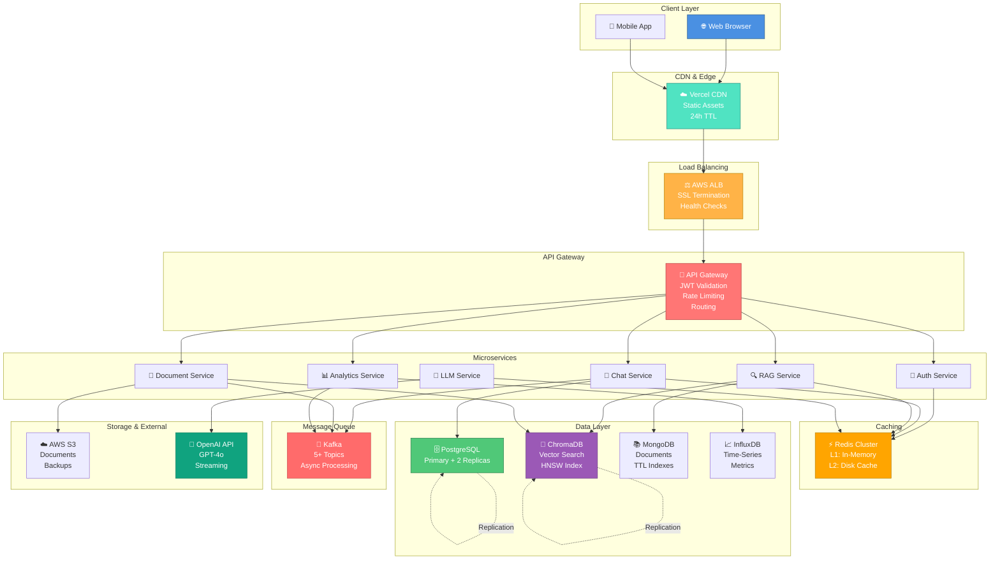
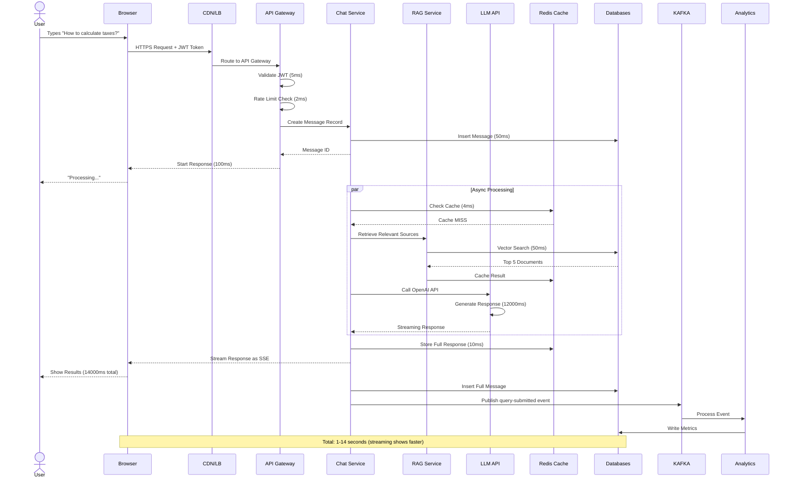
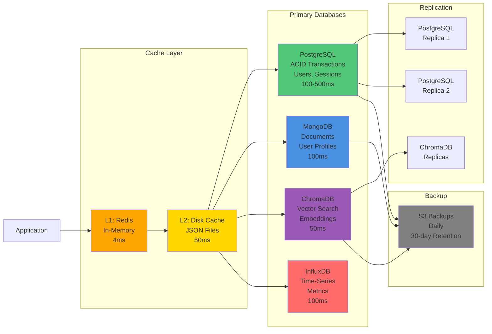
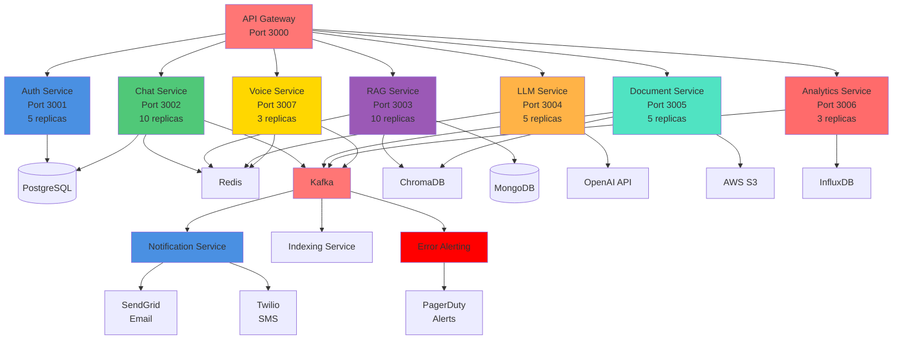
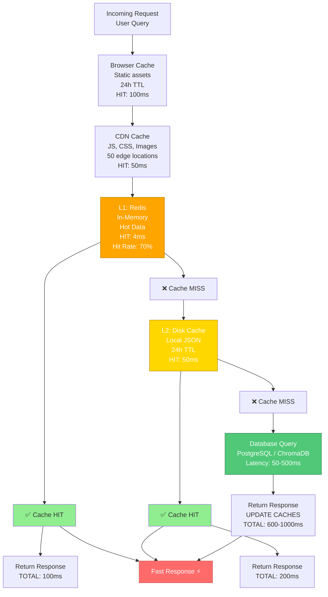
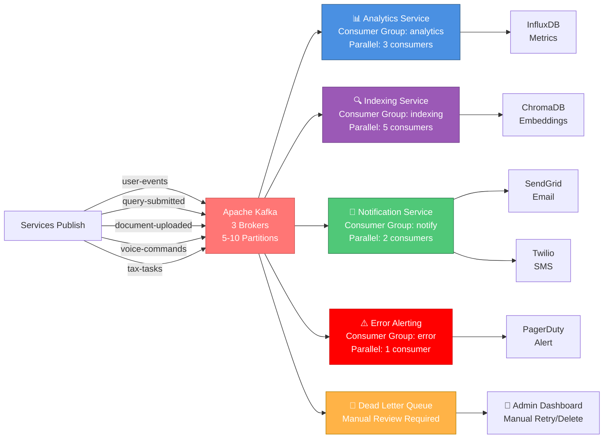
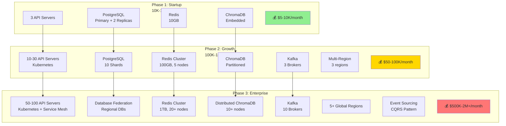
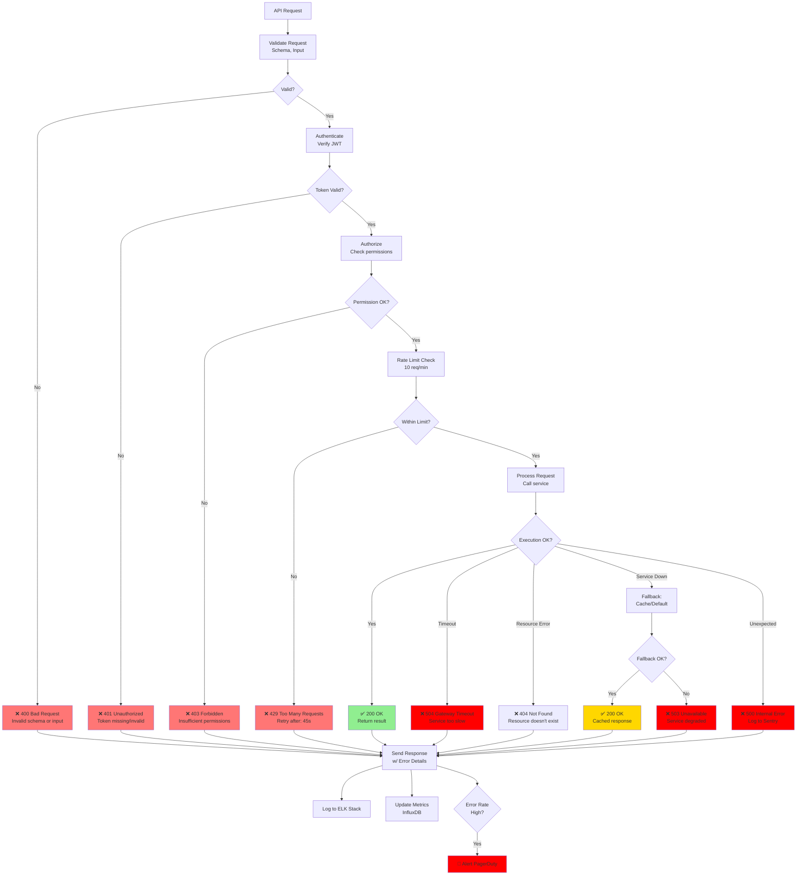
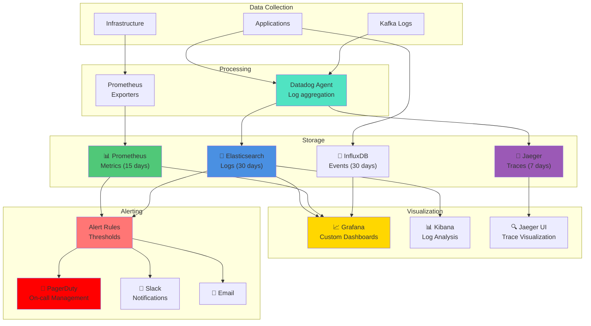
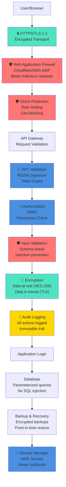

# 🎨 ARTH-MITRA: Mermaid Architecture Diagrams

## 1. High-Level System Architecture

---

## 2. Request Lifecycle Flow

---

## 3. Database Architecture

---

## 4. Microservices Architecture

---

## 5. Caching Strategy

---

## 6. Kafka Event Processing

---

## 7. Scaling Tiers

---

## 8. API Error Handling

---

## 9. Monitoring & Observability Stack

---

## 10. Security Layers

---

**Diagram Version**: 1.0  
**Last Updated**: May 10, 2025  
**Format**: Mermaid (auto-renders in GitHub)
