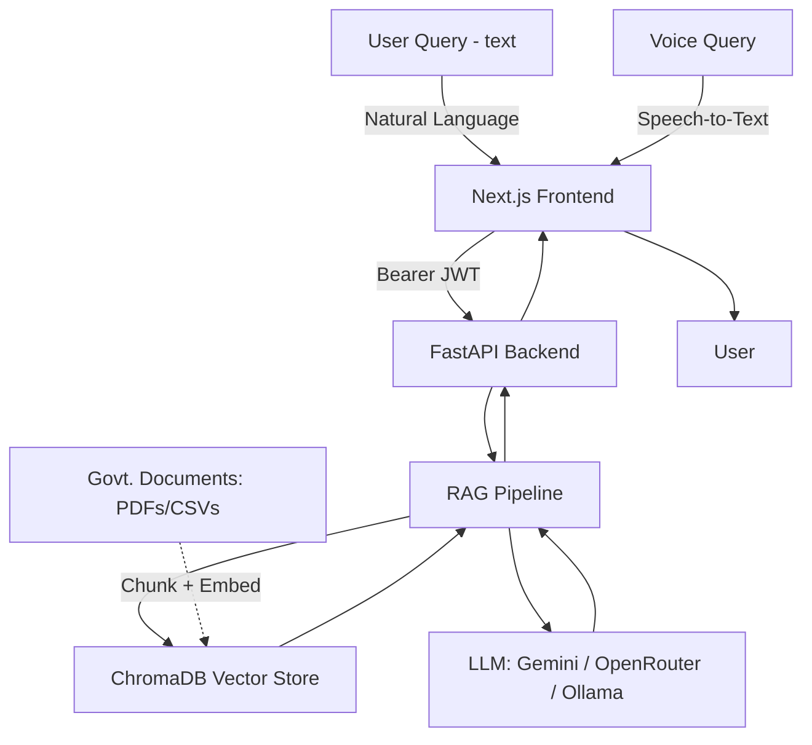

# 🇮🇳 Arth-Mitra — AI-Powered Financial Assistant for India

<div align="center">


[](https://nextjs.org/)
[](https://react.dev/)
[](https://www.typescriptlang.org/)
[](https://fastapi.tiangolo.com/)
[](LICENSE)

**Navigate Indian finance with ease.**

*Understand complex tax laws, government schemes, and investment options in plain language.*

[Report Bug](https://github.com/aryanb1906/ARTH-MITRA/issues) • [Request a Feature](https://github.com/aryanb1906/ARTH-MITRA/discussions)

</div>

---

## Table of Contents

- [What is Arth-Mitra?](#what-is-arth-mitra)
- [Core Features](#core-features)
- [Architecture](#architecture)
- [Tech Stack](#tech-stack)
- [Getting Started](#getting-started)
- [Security](#security)
- [Project Structure](#project-structure)
- [Known Limitations](#known-limitations)
- [Roadmap](#roadmap)
- [Contributing](#contributing)
- [License](#license)

---

## What is Arth-Mitra?

India has hundreds of government financial schemes, tax rules, and welfare policies — but they're written in legal/bureaucratic language, scattered across PDFs and portals, and hard for an average citizen to act on. As a result, eligible people miss benefits, overpay taxes, or rely on expensive intermediaries.

**Arth-Mitra** is a RAG-powered conversational assistant that answers financial questions in plain language, grounded in official government documents (Income Tax Act, scheme guidelines, budget documents, RBI/NSDL material), with source citations for every claim.

| Traditional approach | Arth-Mitra |
|---|---|
| Legal/bureaucratic language | Plain-language explanations |
| Generic information | Personalized to your income, age, and goals |
| Scattered across portals | One conversational interface |
| Manual document search | Semantic retrieval with cited sources |
| Text-only | Voice-first copilot (English / Hindi / Hinglish) |

> ⚠️ **Not financial or legal advice.** Arth-Mitra provides informational guidance based on public government data. It does not replace a qualified CA, tax consultant, or financial advisor — always verify anything consequential against the official source.

---

## Core Features

### 💬 Conversational Assistant
- RAG-powered chat over 24+ official documents (Income Tax Act, Finance Act, scheme rules, budget docs), with cited sources for every answer.
- Document upload (PDF/TXT/CSV/MD/DOCX) for source-grounded, document-only Q&A.
- Confidence score, "why this answer," source highlights, scheme ranking, and side-by-side scheme comparison.
- Auto-inferred charts from numeric answers, pinned chart snapshots, chart export as PNG.
- Saved messages/bookmarks with notes and tags; pin important responses to the top of a session.
- Chat export to HTML/PDF; session rename/delete/history.
- Gold price historical lookup (date-aware, bypasses the RAG pipeline for instant results).

### 🎙️ Voice Copilot
- Speech-to-text (Web Speech API) + text-to-speech (browser `SpeechSynthesis` and server-side OpenAI TTS), trilingual across English, Hindi, and Hinglish.
- 13 quick voice commands (navigate, new chat, switch language, read page, summarize, export, etc.) and multi-turn guided flows (voice-driven tax wizard, scheme finder).
- Animated avatar, real-time mic waveform visualizer, haptic + audio feedback, barge-in/interrupt support.
- Backend-side prompt-injection filtering, destructive-action blocking, and per-user rate limiting.

### 🧮 Tax & Planning Tools
- Old vs. New regime tax calculator with full deduction support (80C, 80D, 80E, 80TTA, HRA, standard deduction) and age-based slabs.
- Goal planner with SIP/inflation-adjusted projections and AI-generated allocation strategy.

### 🔐 Accounts & Platform
- Email/password auth plus Google and GitHub OAuth (with CSRF-protected state handling).
- Backend-enforced authorization: every profile/session/document/saved-message endpoint verifies the caller owns the resource via a signed JWT, not just a client-supplied ID.
- Analytics dashboard, saved sessions, account settings (password change, account deletion).

---

## Architecture


```mermaid
graph TB
    A[User Query - text] -->|Natural Language| B[Next.js Frontend]
    A2[Voice Query] -->|Speech-to-Text| B
    B -->|Bearer JWT| C[FastAPI Backend]
    C --> D[RAG Pipeline]
    D --> E[ChromaDB Vector Store]
    D --> F[LLM: Gemini / OpenRouter / Ollama]
    E --> D
    F --> D
    D --> C
    C --> B
    B --> L[User]

    G[Govt. Documents: PDFs/CSVs] -.->|Chunk + Embed| E
```

**Request flow:** query → multi-layer cache check (L1 memory, L2 disk) → embed query (ONNX-accelerated `all-MiniLM-L6-v2`) → semantic search in ChromaDB → build context from top-K chunks → LLM generates a grounded, plain-language answer → response cached and returned with source citations.

**LLM fallback chain:** Gemini 2.5 Flash → OpenRouter (`gpt-4o-mini`) → local Ollama (`gemma3:1b`) if no cloud key is configured, so the app can run fully offline for development.

---

## Tech Stack

**Frontend** — Next.js 15, React 19, TypeScript, Tailwind CSS, Radix UI / shadcn-ui, React Hook Form + Zod, Web Speech API + Web Audio API for voice.

**Backend** — FastAPI (Python 3.11+), LangChain, ChromaDB (HNSW, persistent), SQLAlchemy + SQLite, ONNX Runtime for accelerated embeddings, PyJWT for auth.

**AI/RAG** — `all-MiniLM-L6-v2` embeddings (ONNX, O2-optimized), Gemini 2.5 Flash / OpenRouter / Ollama for generation, multi-layer response cache (in-memory LRU + disk, with TTL-based eviction on both layers).

---

## Getting Started

### Prerequisites
```
Node.js >= 18.17
Python  >= 3.11
pnpm (recommended) or npm
```

### 1. Clone
```bash
git clone https://github.com/aryanb1906/ARTH-MITRA.git
cd ARTH-MITRA
```

### 2. Backend setup
```bash
cd backend
pip install -r requirements.txt
```

Create `backend/.env`:
```env
# LLM — set at least one, or the app falls back to a local Ollama model
GEMINI_API_KEY=your_gemini_api_key_here       # https://aistudio.google.com/app/apikey (free tier)
# OPENROUTER_API_KEY=your_openrouter_key_here
# OPENAI_API_KEY=your_openai_key_here          # required only for server-side voice TTS

# Auth — MUST be the same random secret as frontend/.env.local's JWT_SECRET
JWT_SECRET=replace_with_a_long_random_string

# CORS — comma-separated list of origins allowed to call this API
ALLOWED_ORIGINS=http://localhost:3100
```

Run it:
```bash
uvicorn main:app --reload --port 8000
```
On first run, it indexes every PDF/CSV/TXT under `backend/documents/` into ChromaDB and pre-warms the embedding model — this can take a minute or two. Drop your own PDF/CSV/TXT files into `backend/documents/` and restart to add them to the knowledge base.

### 3. Frontend setup
```bash
cd frontend
pnpm install   # or npm install
```

Create `frontend/.env.local`:
```env
NEXT_PUBLIC_APP_URL=http://localhost:3100
NEXT_PUBLIC_API_URL=http://localhost:8000

# Auth — MUST match backend/.env's JWT_SECRET exactly
JWT_SECRET=replace_with_a_long_random_string

# OAuth password derivation secret — long random string, set once and never change
# (changing it locks out existing Google/GitHub-linked accounts)
OAUTH_PASSWORD_SECRET=replace_with_another_long_random_string

# Optional: Google/GitHub OAuth
# GOOGLE_CLIENT_ID=...
# GOOGLE_CLIENT_SECRET=...
# GITHUB_CLIENT_ID=...
# GITHUB_CLIENT_SECRET=...

# Optional: unauthenticated demo access via ?demo=<token> (leave unset in production)
# DEMO_ACCESS_TOKEN=...
```

Run it:
```bash
PORT=3100 npm run dev
```

### 4. Open the app
- Frontend: http://localhost:3100
- Backend docs (Swagger): http://localhost:8000/docs

---

## Security

This project went through a security-focused hardening pass. Current model:

- **Authentication**: the frontend signs a JWT (HS256) on login/register/OAuth and stores it in an httpOnly cookie for page routing, and also returns it to the client so it can be attached as `Authorization: Bearer <token>` on API calls (via an axios interceptor in `lib/api.ts`).
- **Authorization**: the FastAPI backend independently verifies that JWT and checks that the authenticated user actually owns the profile/session/document/saved-message being accessed — resource IDs in the URL are no longer trusted on their own.
- **OAuth**: Google/GitHub sign-in uses a CSRF `state` parameter validated against an httpOnly cookie, and the account's linking "password" is derived via HMAC from a server-only secret (`OAUTH_PASSWORD_SECRET`) rather than the provider's public user ID.
- **CORS** is restricted to an explicit allow-list (`ALLOWED_ORIGINS`) instead of `*`.
- **Rate limiting** on chat, TTS, and voice-assistant endpoints to bound API cost exposure.
- **Uploads** are sanitized against path traversal (filenames are stripped to their basename; deletion re-validates the resolved path stays inside the upload directory).
- No PAN, Aadhaar, or bank account details are ever collected or stored.

If you fork this project for production use, generate your own `JWT_SECRET` and `OAUTH_PASSWORD_SECRET` (long, random, and identical between frontend/backend for `JWT_SECRET`) — never reuse the placeholder values from `.env.example`.

---

## Project Structure

```
ARTH-MITRA/
├── frontend/                  # Next.js app
│   ├── app/                   # Routes: chat, tax-calculator, goal-planner, analytics, settings, auth pages
│   │   └── api/auth/          # Auth route handlers (credentials + Google/GitHub OAuth)
│   ├── components/
│   │   ├── ui/                 # shadcn/ui components
│   │   └── voice-assistant/    # Voice copilot (STT/TTS, avatar, quick commands, safety)
│   └── lib/                    # Shared API client, auth helpers, goal-planning math
└── backend/                   # FastAPI app
    ├── main.py                # API endpoints (chat, auth, documents, sessions, voice, TTS)
    ├── bot.py                  # RAG pipeline, scheme ranking, gold-price lookup
    ├── cache.py                 # Multi-layer response cache (L1 memory + L2 disk)
    ├── onnx_embeddings.py       # ONNX-accelerated embedding wrapper
    ├── database.py / models.py / crud.py   # SQLite persistence layer
    └── documents/               # Source knowledge base (PDFs, CSVs, TXT)
```

---

## Known Limitations

- Scope is currently personal income tax + common government schemes; business tax (GST, corporate) is not yet covered.
- Not a filing tool — it gives guidance, not e-filing.
- Voice assistant STT requires a Chromium-based browser (Web Speech API support); server TTS requires an OpenAI API key.
- Offline mode (no cloud LLM key) requires a local Ollama install with the `gemma3:1b` model pulled.
- Response latency depends on which LLM backend is configured; cached queries are always fast, first-time queries against a cloud LLM take several seconds.

---

## Roadmap

- Hybrid search (BM25 + vector) and a cross-encoder re-ranker for retrieval precision.
- Additional Indian languages beyond Hindi/Hinglish (Tamil, Telugu, Kannada, Marathi).
- Step-by-step guided tax-filing flow.
- Automated test suite and CI pipeline for both frontend and backend.

---

## Contributing

1. Fork the repo and create a feature branch: `git checkout -b feature/your-feature`
2. Make your changes, following the existing TypeScript/ESLint conventions on the frontend and the existing style on the backend.
3. `npm run lint` and `npx tsc --noEmit` (frontend) before opening a PR.
4. Open a pull request describing what changed and why.

Bug reports and feature requests: [GitHub Issues](https://github.com/aryanb1906/ARTH-MITRA/issues).

### Contributors

| Name | GitHub |
|---|---|
| Aryan | [@aryanb1906](https://github.com/aryanb1906) |
| Aditya | [@bigbrainbarik](https://github.com/bigbrainbarik) |
| Naman | [@nmncodes](https://github.com/nmncodes) |
| Poushali | [@patrapoushali](https://github.com/patrapoushali) |
| Aayushi | [@AaS2703](https://github.com/AaS2703) |
| Rohan | [@Rohan01000](https://github.com/Rohan01000) |

<a href="https://github.com/aryanb1906/ARTH-MITRA/graphs/contributors">
  
</a>

---

## License

MIT — see [LICENSE](LICENSE).

---

<div align="center">

**Made for 🇮🇳 India** — empowering citizens with financial knowledge, one conversation at a time.

[⬆ Back to top](#-arth-mitra--ai-powered-financial-assistant-for-india)

</div>
